# Inventory Management System

## Overview

This project is an Inventory Management System built with Flutter. It allows users to manage and keep track of various products like stationery, groceries, and more. Users can log in to the app, create and manage categories, add items under each category, and adjust the quantities of these items. If the quantity of an item drops to zero, it is automatically added to a shopping list. Users can add and remove items into the shopping list.

## Tech Stack

- **Language:** Dart
- **Framework:** Flutter
- **IDE:** Android Studio
- **Database:** sqflite

## Features

- **User Authentication:** Secure login system.
- **Category Management:** Create and manage different categories for products.
- **Product Management:** Add items under each category and adjust quantities as needed.
- **Automatic Shopping List:** Items with zero quantity are automatically added to the shopping list.


## Installation

1. **Clone the Repository:**

    ```bash
    git clone https://github.com/kv-06/Inventory-Management-System.git
    ```

2. **Navigate to the Project Directory:**

    ```bash
    cd your-repository
    ```

3. **Install Dependencies:**

    ```bash
    flutter pub get
    ```

4. **Run the App:**

    ```bash
    flutter run
    ```

## Usage

1. **Login:**
   - Navigate to 'signin.dart' and run this file to start the app.
   - Open the app and log in with your credentials.

2. **Manage Categories:**
   - Add, edit, or delete categories as needed.

3. **Manage Products:**
   - Add items under each category.
   - Adjust item quantities (increment or decrement).
   - Add, edit, or delete item details as needed.

4. **Shopping List:**
   - Add the items and the quantity to buy
   - View the shopping list which automatically updates with items whose quantities have reached zero.

## Contribution
Contributions are welcome! Please open an issue or submit a pull request for any improvements or suggestions.

## License
This project is licensed under the MIT License - see the [LICENSE](LICENSE) file for details.

## Screenshots

### 1. Home Page
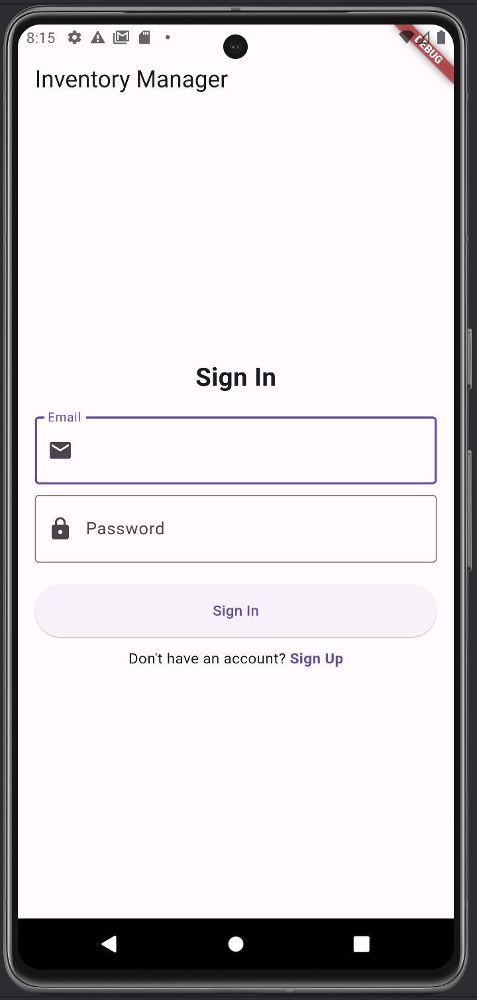

### 2. Sign Up


### 3. Add categories
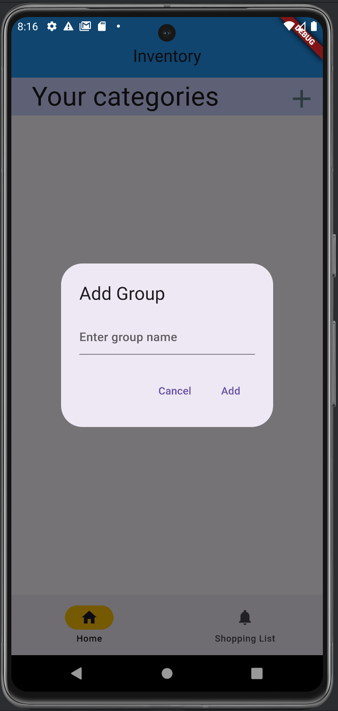

### 4. Add items
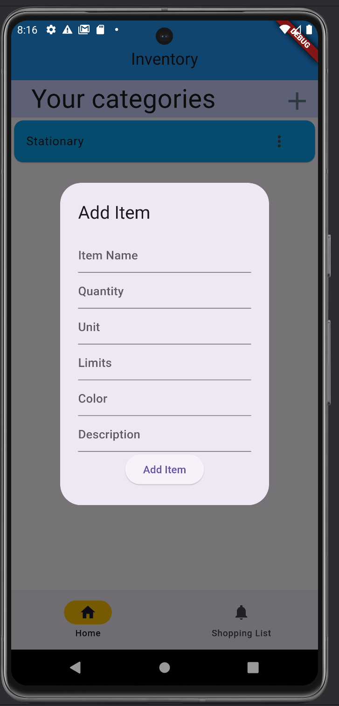

### 5. Dashboard after adding
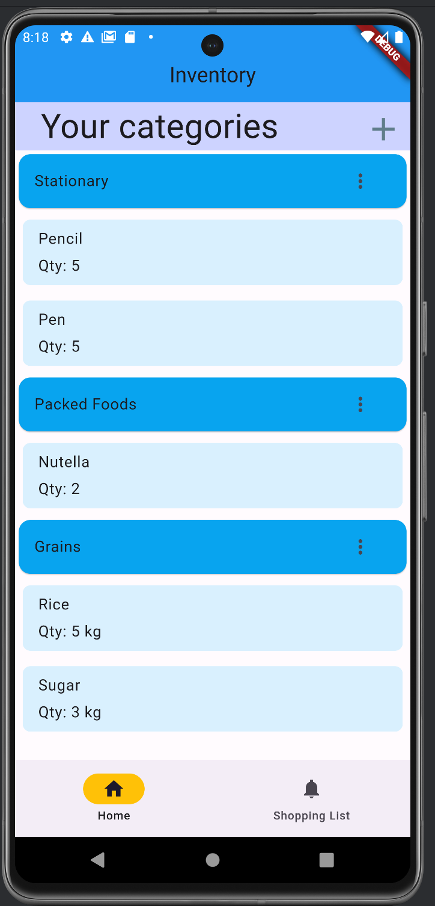

### 6. Edit items
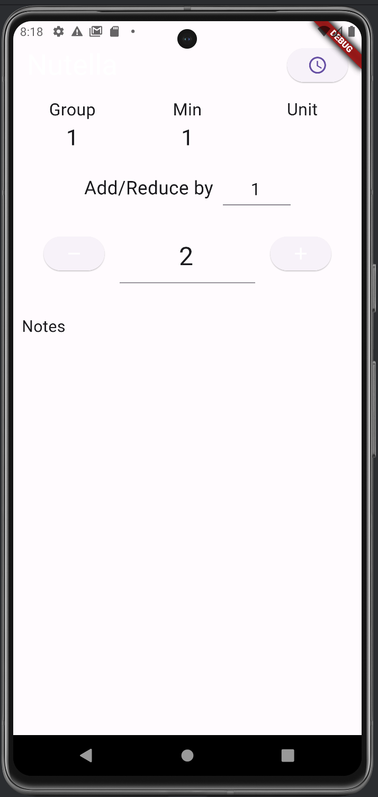

### 7. History of edits
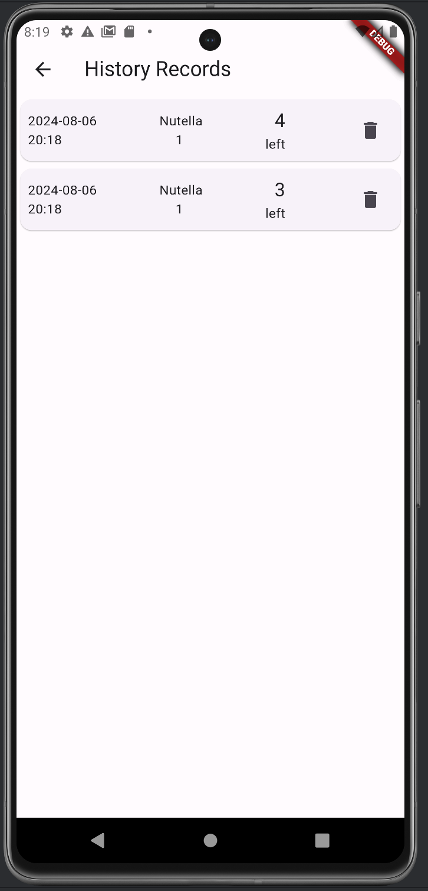

### 8. After edit
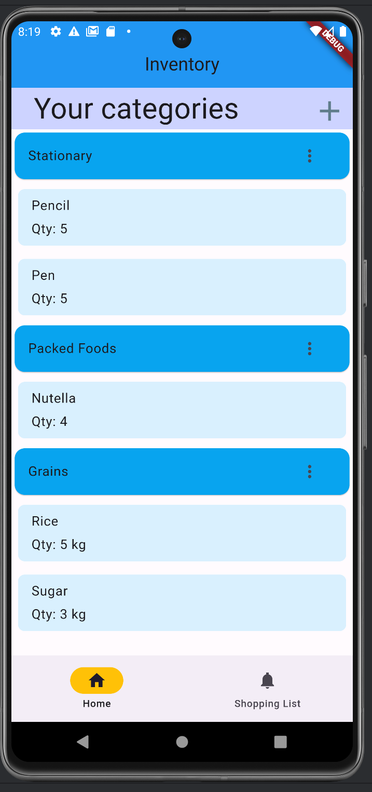

### 9. Editing group name
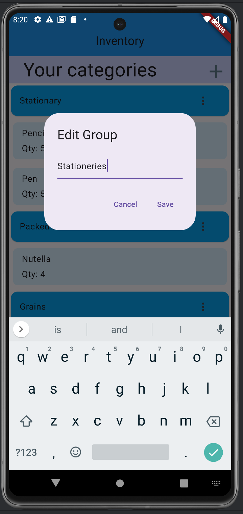

### 10. After edit of group name
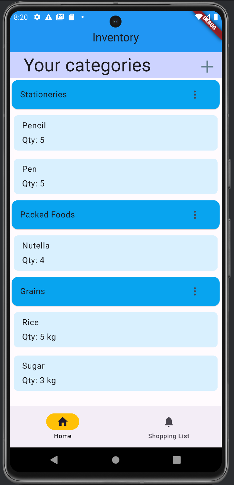

### 11. Deletion
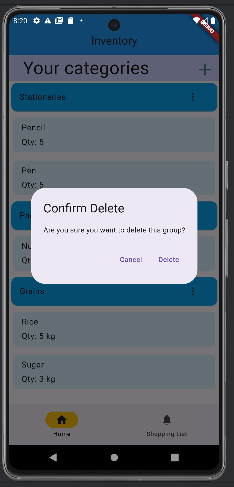

### 12. After delete
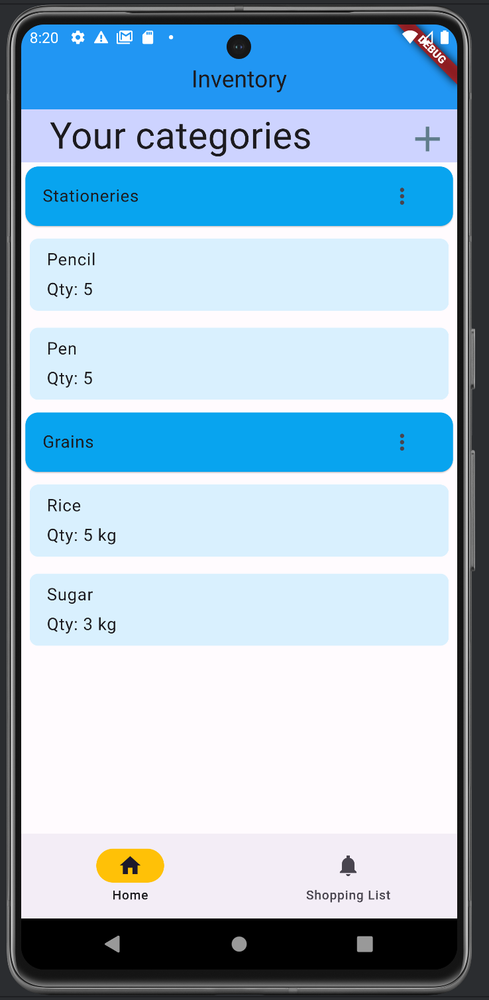

### 13. Shopping list
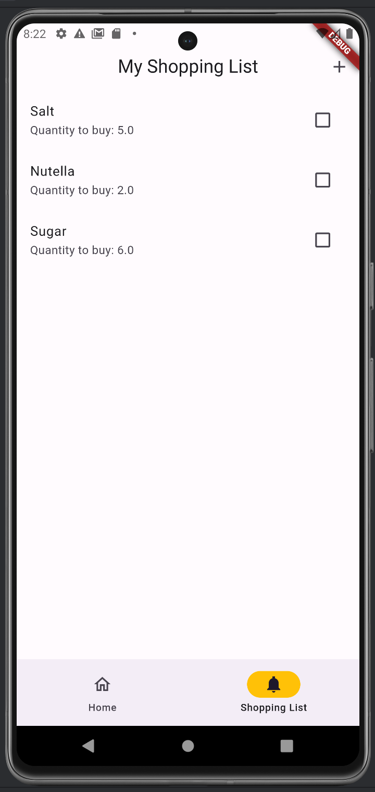

### 14. Tickboxes
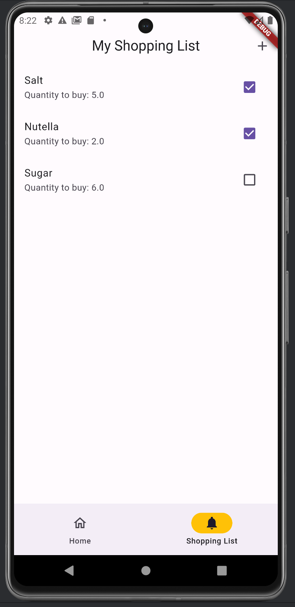

### 15. Swipe right to delete
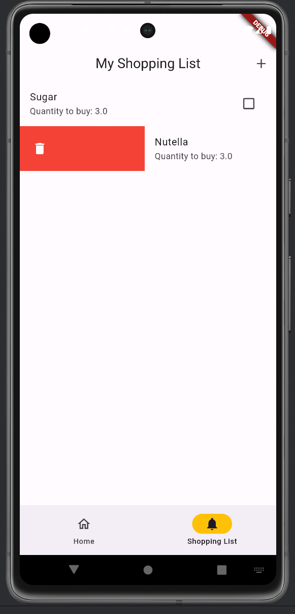

### 16. After deletion
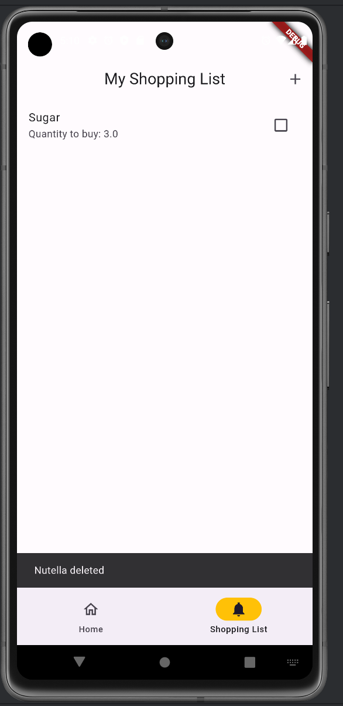

### 17. Swipe left to add
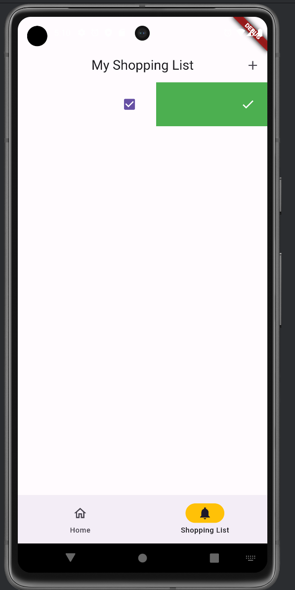

### 18. After add
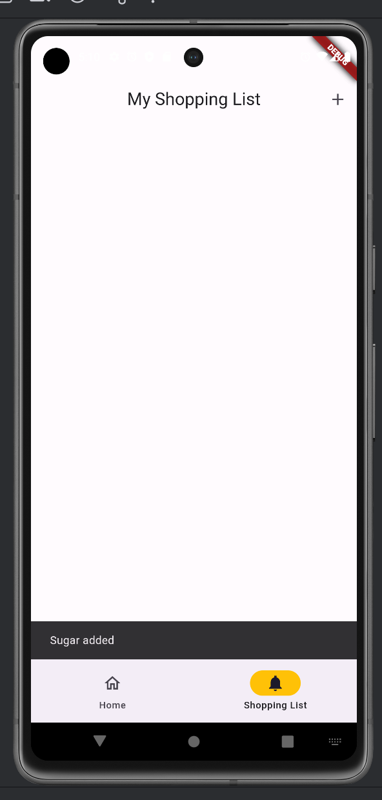


Thank you for checking out this project!
